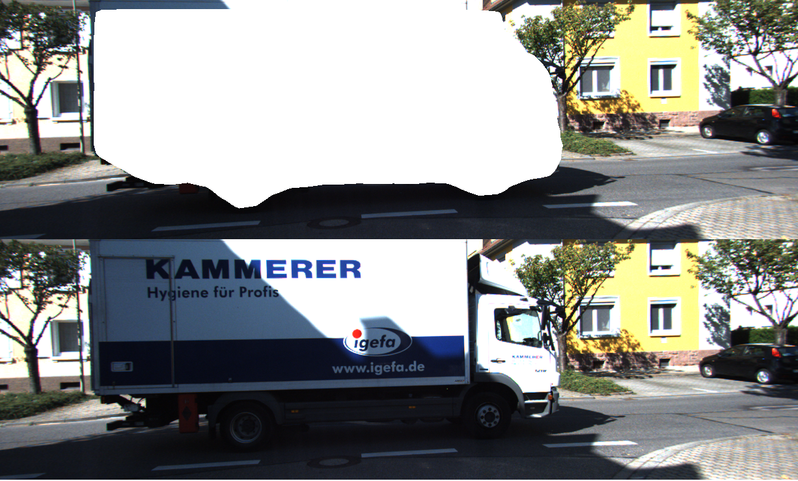

# RDR_SLAM

RDR_SLAM is a visual SLAM system that is robust in dynamic scenarios for stereo configurations. Having a static map of the scene allows inpainting the frame background that has been occluded by such dynamic objects.



RDR_SLAM: Semantic Segmentaton of Moving Objects   

We provide examples to run the SLAM system in the [KITTI dataset](http://www.cvlibs.net/datasets/kitti/eval_odometry.php) as stereo.


## Getting Started
- Install DynaSLAM (https://github.com/BertaBescos/DynaSLAM).
- Install and run GANet (https://github.com/linpeisensh/GANet)
- Install and run SNE-RoadSeg (https://github.com/linpeisensh/SNE-RoadSeg)
- Clone this repo:
```
mkdir build
cd build
cmake ..
make
make install
```

## Stereo Example on KITTI Dataset
- Download the dataset (color images) from http://www.cvlibs.net/datasets/kitti/eval_odometry.php 

- Execute the following command. Change `PATH_TO_ORB`to ORB_SLAM2 folder. Change `PATH_TO_SEQUENCES` to the uncompressed dataset folder. Change `DEVICE` to cpu or cuda. Change `SAVE` to 0 (not save) or 1. Change `SEQUENCE` to 00, 01, 02,.., 10. 
(Edit `depth_path`, `prob_path`, `config_file` in RDR.py and Execute in `examples` folder)
```
python RDR.py (PATH_TO_ORB) (PATH_TO_SEQUENCES) (DEVICE) (SAVE) (SEQUENCE) 
```
example:
```
python RDR.py /usr/stud/linp/storage/user/linp/ORB_SLAM2 /storage/remote/atcremers17/linp/dataset/kittic/sequences/ cuda 0 10
```

## Citation

If you use RDR_SLAM in an academic work, please cite:

    @article{lin2021rdrslam,
      title={{RDR_SLAM}: Semantic Segmentaton of Moving Objects  },
      author={Lin, Peisen},
      year={2021}
     }

## Acknowledgements
Our code builds on [DynaSLAM](https://github.com/BertaBescos/DynaSLAM). [ORB_SLAM2-PythonBindings](https://github.com/jskinn/ORB_SLAM2-PythonBindings).

